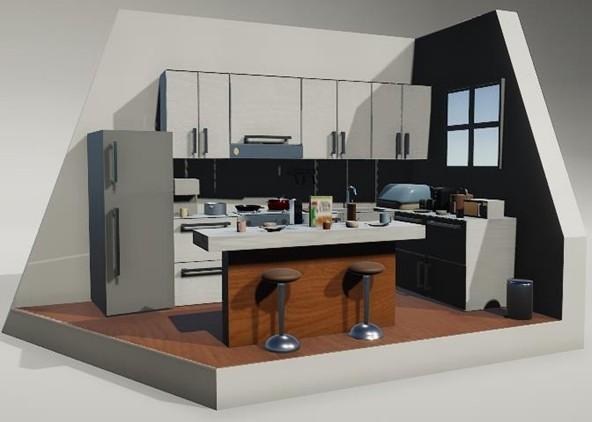

# Kitchen Diorama

A detailed 3D kitchen diorama project developed using Autodesk Maya, Adobe Substance 3D Painter, and Unity. This project focuses on environment modeling, texturing, lighting, and scene composition within a stylized modern kitchen setting.

---

## Project Overview

This project was created as part of a university 3D design assignment. The diorama depicts a cozy morning kitchen scene featuring various kitchen appliances, furniture, utensils, and environmental details designed to create a warm and lived-in atmosphere.

The project involved:
- 3D environment modeling
- UV mapping
- Texturing and material creation
- Lighting setup
- Scene composition
- Unity integration and rendering

---

## Tools & Technologies

- Autodesk Maya
- Adobe Substance 3D Painter
- Unity
- FBX Workflow Pipeline

---

## Features

- Fully modeled kitchen environment
- Custom kitchen appliances and furniture
- Stylized lighting and scene setup
- UV unwrapping and texture optimization
- Physically-based texturing workflow
- Unity scene integration

---

## Workflow

### 1. Modeling in Autodesk Maya
Created and modeled all kitchen assets including:
- refrigerator
- kitchen island
- chairs
- appliances
- utensils
- cookware
- decorations

Techniques used:
- extrusion
- scaling
- smoothing
- duplication
- polygon modeling

### 2. Texturing in Adobe Substance 3D Painter
Applied:
- metallic materials
- roughness maps
- normal maps
- ambient occlusion maps

Textures were exported using a custom PBR workflow pipeline.

### 3. Unity Integration
Imported assets into Unity and:
- configured materials
- applied textures
- adjusted shaders
- created environmental lighting
- finalized scene rendering

---

## Screenshots

### Final Kitchen Diorama

---

## Documentation

The full development process and production report can be found in:

- `Kitchen_Diorama_Report.pdf`

---

## Learning Outcomes

Through this project, I developed experience in:
- 3D environment design
- asset creation workflows
- UV mapping and optimization
- PBR texturing pipelines
- lighting and scene composition
- cross-software workflow integration

---

## Author

Felicia Jolie
